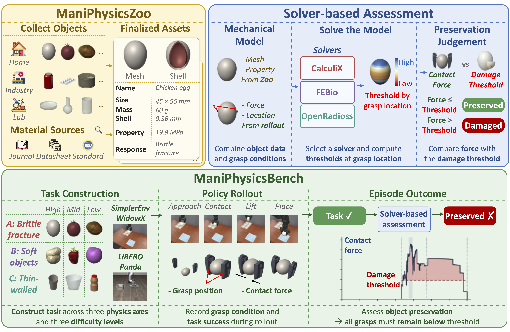

# ManiPhysicsBench



Official source code for ManiPhysicsBench: Physics-Based Assessment of Object Preservation in VLA Manipulation.

## Structure

```
src/maniphysics/   assessment, benchmark environments, evaluation, relabeling
tools/             solver installation and Zoo viewer
zoo/benchmark/     benchmark objects used by the solvers
zoo/assets/        ManiPhysicsZoo object cards and assets
zoo/html/          ManiPhysicsZoo viewer
bench/assets/      rollout assets for SimplerEnv and LIBERO
bench/evaluation/  model catalog for rollouts
bench/relabeling/  relabeling inputs and training configs
third_party/       external source and licenses
```

## Environment

```bash
conda env create -f environment.yml
conda activate maniphysics-fem
export PATH="$CONDA_PREFIX/bin:$PATH"
python -m pip install --no-deps --no-build-isolation -e .
python tools/install_fem.py --jobs 4 --threads 2
```

This installs CalculiX 2.23, FEBio 4.13, and OpenRadioss under `runtime/` and writes `runtime/fem.json`.

## Zoo viewer

```bash
python tools/serve_zoo.py --port 8000
```

Open `http://localhost:8000/zoo/html/index.html`.

## Assessment

```bash
maniphysics assess <grasp.json> --runtime runtime/fem.json --output <dir>
python -m maniphysics.evaluation.batch <rollout_dir> --runtime runtime/fem.json --output <dir>
```

## Rollouts

Each model runs in its original repository environment with its own checkpoint. `bench/evaluation/models.json` lists the server and runner for each model.

```bash
python -m maniphysics.evaluation.models simpler/pi0 --runtime <model_runtime.json> --tasks <task> --gpu 0 --output <dir>
```

`<model_runtime.json>` sets `external_root` (upstream repositories and checkpoints) and `python` (interpreter for each environment). `<task>` is a SimplerEnv environment ID such as `ManiPhysEgg-v0` or a LIBERO task such as `Egg`.

## Training

Object-specific gripper relabeling on Bridge for QwenGR00T. For the selected episodes in `bench/relabeling/selected_episodes.jsonl`, closing-gripper labels are replaced with object-specific targets. Arm actions and all other labels are kept.

```bash
python -m maniphysics.training.targets --selected bench/relabeling/selected_episodes.jsonl --categories bench/relabeling/categories.json --output <policy>
python -m maniphysics.training.prepare --source-config bench/relabeling/configs/qwengr00t_bridge.json --deepspeed-config bench/relabeling/configs/deepspeed.json --base-vlm <Qwen3-VL-4B-Instruct> --dataset-root <bridge_lerobot> --policy <policy>/candidate_episodes.jsonl --output <prepared> --training-output <run> --gpus 0,1,2,3,4,5,6
python -m maniphysics.training.launch --prepared <prepared> --accelerate <accelerate> --external-root <external_root>
```

- `targets.py`: per-object force target from `bench/relabeling/categories.json`, the midpoint of the lifting force and the damage estimate (lifting force plus a margin if no estimate is available), capped at 4 N
- `bridge.py`, `qwen_patch.py`: replace gripper labels during data loading
- `prepare.py`: training config from `bench/relabeling/configs/`
- `launch.py`: LoRA training of QwenGR00T with accelerate

All modules are in `src/maniphysics/training/`. `prepare` and `launch` run in the starVLA environment.

## Licenses

Third-party licenses are in `third_party/` and `zoo/html/vendor/three-LICENSE.txt`. Asset attributions are in `zoo/assets/attributions.json`.
